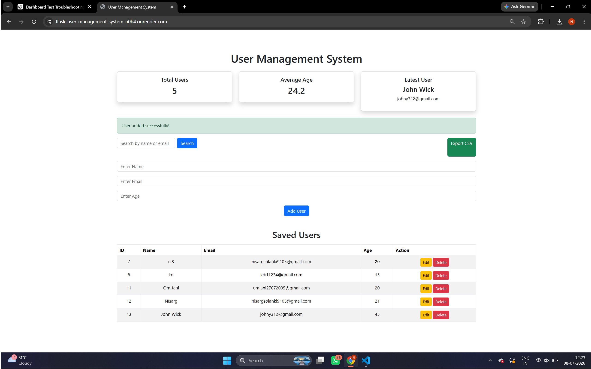

# User Management System

## Live Demo

🌐 https://flask-user-management-system-n0h4.onrender.com

## Project Description

A Flask-based User Management System that allows users to add, view, edit, and delete user information. This project demonstrates the integration of frontend, backend, and database technologies in a full stack web application.

## Technologies Used

* Python
* Flask
* SQLite
* HTML
* CSS
* Render (Deployment)
* Git & GitHub

## Features

* Add new users
* Display user details in a table
* Edit existing users
* Delete users
* Store data using SQLite database
* Responsive and user-friendly interface

## Project Structure

```text
flask-user-management-system/
│
├── app.py
├── database.db
├── requirements.txt
├── README.md
├── static/
│   └── style.css
└── templates/
    ├── index.html
    └── edit.html
```

## Website Screenshot



## How to Run the Project Locally

1. Clone the repository:

```bash
git clone https://github.com/nisargsolanki10/flask-user-management-system.git
```

2. Navigate to the project folder:

```bash
cd flask-user-management-system
```

3. Install dependencies:

```bash
pip install -r requirements.txt
```

4. Run the Flask application:

```bash
python app.py
```

5. Open your browser and visit:

```text
http://127.0.0.1:5000
```

## Author

Nisarg Solanki
